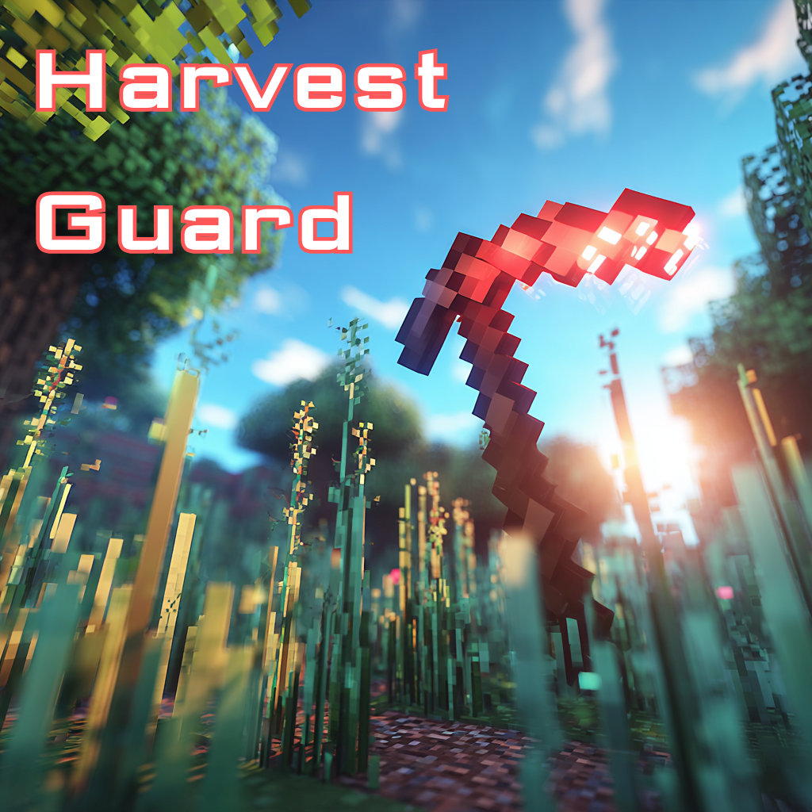

# Minecraft Addons

A collection of Bedrock Edition behavior packs.

---

##  Harvest Guard 
> A vanilla-friendly farming safety add-on for Minecraft Bedrock Edition.

Prevents players from accidentally destroying crops before they are ready to harvest, and protects the base blocks of vertical plants. Activates only when the player is holding a configured tool (hoe or axe), so normal gameplay is unaffected.

### Features

- **Crop protection** — blocks breaking unripe wheat, carrots, potatoes, beetroot, nether wart, and cocoa pods
- **Stem protection** — always blocks breaking melon and pumpkin stems
- **Cave vine protection** — always blocks breaking cave vines (all variants: plain, head with berries, body with berries)
- **Sweet berry bush protection** — always blocks breaking sweet berry bushes
- **Base protection** — only protects the *bottom* block of sugar cane, bamboo, and cactus columns; upper blocks can be harvested freely
- **Bamboo sapling protection** — always blocks breaking bamboo saplings
- **Farmland protection** — always blocks breaking farmland directly
- **Cocoa log protection** — blocks breaking a jungle log that has an unripe cocoa pod attached; shares the Cocoa toggle (no extra setting)
- **Per-player settings** — every player configures their own tool group and which crops to protect
- **Multiplayer safe** — settings are stored per-player via dynamic properties; no shared state

### Protected Blocks Reference

| Category | Block | Rule | Mature / Safe to break |
|---|---|---|---|
| Crops | Wheat | Growth-based | `growth = 7` |
| Crops | Carrots | Growth-based | `growth = 7` |
| Crops | Potatoes | Growth-based | `growth = 7` |
| Crops | Beetroot | Growth-based | `growth = 7` |
| Crops | Nether Wart | Growth-based | `age = 3` |
| Crops | Cocoa | Growth-based | `age = 2` |
| Crops | Jungle Log | Cocoa base | No unripe pod on any side |
| Stems | Melon Stem | Always blocked | — |
| Stems | Pumpkin Stem | Always blocked | — |
| Vines | Cave Vines (all variants) | Always blocked | — |
| Vines | Sweet Berry Bush | Always blocked | — |
| Bases | Sugar Cane | Base only | Upper blocks free |
| Bases | Bamboo | Base only | Upper blocks free |
| Bases | Bamboo Sapling | Always blocked | — |
| Bases | Cactus | Base only | Upper blocks free |
| Other | Farmland | Always blocked | — |

### Tool Groups

The add-on only activates when the player holds a tool from the selected group. Wooden tools are excluded by design.

| Index | Group | Tools |
|---|---|---|
| 0 | Hoes | Iron, Golden, Diamond, Netherite, Copper hoe |
| 1 | Axes | Iron, Golden, Diamond, Netherite, Copper axe |
| 2 | Hoes & Axes | All of the above |

### Installation

1. Download or clone the repository
2. Copy the `HarvestGuard` folder into your world's `behavior_packs` directory
3. Activate the pack in your world settings
4. Each player enables it via `/scriptevent hg:active true`

### Usage

All commands are issued in-game via the `/scriptevent` command:

| Command | Description |
|---|---|
| `/scriptevent hg:settings` | Open the settings dialog (tool group, crop toggles, debug level) |
| `/scriptevent hg:active true\|false` | Enable or disable Harvest Guard for yourself |
| `/scriptevent hg:restore` | Reset all your settings to defaults |
| `/scriptevent hg:show` | Print your current settings to chat |

### Settings

Settings are configured per-player through the in-game dialog (`hg:settings`):

| Setting | Default | Description |
|---|---|---|
| Enable | Off | Master on/off switch |
| Tool | Hoes | Which tool group triggers the guard |
| Wheat | On | Protect unripe wheat |
| Carrots | On | Protect unripe carrots |
| Potatoes | On | Protect unripe potatoes |
| Beetroot | On | Protect unripe beetroot |
| Nether Wart | On | Protect unripe nether wart |
| Cocoa | On | Protect unripe cocoa pods and their host jungle log |
| Melon Stem | On | Protect melon stems |
| Pumpkin Stem | On | Protect pumpkin stems |
| Sweet Berry Bush | On | Protect sweet berry bushes |
| Cave Vines | On | Protect cave vines |
| Sugar Cane | On | Protect base of sugar cane |
| Bamboo | On | Protect base of bamboo and bamboo saplings |
| Cactus | On | Protect base of cactus |
| Protect Breaking Farmland | On | Protect farmland from being broken directly |
| Debug Level | None | `Basic` logs guard events to the content log |

### Requirements

- Minecraft Bedrock Edition
- Scripting API: `@minecraft/server` 2.5.0, `@minecraft/server-ui` 2.0.0

---

## ZipIt

> A vanilla-friendly inventory management add-on for Minecraft Bedrock Edition.

Automatically compacts items into storage blocks as you pick them up, and merges partial stacks of the same item together — keeping your inventory clean without touching a single chest. All packing happens in the background; nothing is moved to a chest or dropped on the ground.

### Features

- **Auto-packing** — when you accumulate enough of a resource (e.g. 9 iron ingots), ZipIt converts them into a storage block (iron block) automatically
- **Cascade packing** — conversions chain in a single tick: nuggets → ingots → blocks if quantities allow
- **Consolidate Stacks** — merges partial stacks of the same item in-place without reordering slots; hotbar positions are always preserved
- **Profile system** — enable the **Miner** profile (raw ores, processed ingots, gems), the **Builder** profile (building materials, nuggets, organic items), or both; flip one toggle to control a whole group of rules
- **Per-rule overrides** — the advanced menu lets you fine-tune each packing rule independently of profiles
- **Per-player settings** — every player configures their own preferences; no shared state
- **Multiplayer safe** — settings are stored per-player via dynamic properties; fully isolated across concurrent players

### Packing Rules

Rules are ordered to support cascades (nuggets pack before ingots pack before blocks).

| Rule | Source | Target | Ratio | Profile |
|------|--------|--------|-------|---------|
| `iron_nugget` | Iron Nugget | Iron Ingot | 9:1 | Builder |
| `gold_nugget` | Gold Nugget | Gold Ingot | 9:1 | Builder |
| `copper_nugget` | Copper Nugget | Copper Ingot | 9:1 | Builder |
| `coal` | Coal | Coal Block | 9:1 | Miner |
| `iron_ingot` | Iron Ingot | Iron Block | 9:1 | Miner & Builder |
| `gold_ingot` | Gold Ingot | Gold Block | 9:1 | Miner & Builder |
| `diamond` | Diamond | Diamond Block | 9:1 | Miner |
| `emerald` | Emerald | Emerald Block | 9:1 | Miner |
| `lapis_lazuli` | Lapis Lazuli | Lapis Block | 9:1 | Miner |
| `copper_ingot` | Copper Ingot | Copper Block | 9:1 | Miner & Builder |
| `netherite_ingot` | Netherite Ingot | Netherite Block | 9:1 | Miner & Builder |
| `amethyst_shard` | Amethyst Shard | Amethyst Block | 4:1 | Miner & Builder |
| `raw_iron` | Raw Iron | Raw Iron Block | 9:1 | Miner |
| `raw_gold` | Raw Gold | Raw Gold Block | 9:1 | Miner |
| `raw_copper` | Raw Copper | Raw Copper Block | 9:1 | Miner |
| `redstone` | Redstone | Redstone Block | 9:1 | Miner & Builder |
| `slime_ball` | Slime Ball | Slime Block | 9:1 | Miner & Builder |
| `wheat` | Wheat | Hay Block | 9:1 | Builder |
| `dried_kelp` | Dried Kelp | Dried Kelp Block | 9:1 | Builder |

### Consolidate Stacks

When enabled, ZipIt scans your inventory on every change and merges partial stacks of the same item type into the fullest slot first, respecting max stack sizes. Skips items with a custom name, lore, or enchantments so renamed tools and enchanted books are never touched.

### Installation

1. Download or clone the repository
2. Copy the `ZipIt` folder into your world's `behavior_packs` directory
3. Activate the pack in your world settings
4. Each player enables it via `/scriptevent zp:settings`

### Usage

All commands are issued in-game via the `/scriptevent` command:

| Command | Description |
|---------|-------------|
| `/scriptevent zp:settings` | Open the basic settings dialog (profiles, consolidation, debug level) |
| `/scriptevent zp:advance` | Open the advanced settings dialog (per-rule toggles) |
| `/scriptevent zp:active true\|false` | Enable or disable ZipIt for yourself |
| `/scriptevent zp:restore` | Reset all your settings to defaults |
| `/scriptevent zp:show` | Print your current settings and rule states to chat |

### Settings

**Basic menu** (`zp:settings`):

| Setting | Default | Description |
|---------|---------|-------------|
| Enable ZipIt | On | Master on/off switch |
| Miner | On | Enable all Miner-profile rules at once |
| Builder | On | Enable all Builder-profile rules at once |
| Consolidate Stacks | On | Merge partial stacks in-place on every inventory change |
| Debug Level | None | `Basic` logs packing and consolidation events to the content log |

**Advanced menu** (`zp:advance`):

| Setting | Default | Description |
|---------|---------|-------------|
| Enable ZipIt | On | Master on/off switch |
| Consolidate Stacks | On | Merge partial stacks in-place |
| Per-rule toggles | Profile default | One toggle per packing rule, grouped by profile |
| Debug Level | None | `Basic` logs packing events |

Per-rule overrides in the advanced menu take priority over profiles. Clearing an override (setting it back to match the profile default) returns control to the profile toggle.

### Requirements

- Minecraft Bedrock Edition
- Scripting API: `@minecraft/server` 2.5.0, `@minecraft/server-ui` 2.0.0

---

## OreDetector

> A live ore-finder HUD for Minecraft Bedrock Edition.

While holding a pickaxe, scans the area around you for nearby ores and shows a live action-bar display with a colored indicator, compass arrow, and distance for each ore type found. Put the pickaxe away and the HUD disappears cleanly.

### Features

- **Live HUD** — updates every tick; shows ore type, relative compass direction, and distance in blocks
- **9 ore types** — Diamond, Emerald, Ancient Debris, Gold, Iron, Copper, Redstone, Lapis, Coal (each individually toggleable)
- **Deepslate & raw block variants** — automatically detects deepslate ores and raw ore blocks (Raw Iron Block, Raw Gold Block, Raw Copper Block)
- **Closest-first sorting** — nearest ore is always shown at the top of the HUD
- **Pickaxe tier selector** — choose which pickaxe tier activates the HUD (All, Wooden & Stone, Iron/Gold/Copper, Diamond & Netherite)
- **Smart rescanning** — scan frequency adapts to distance; closer ores trigger more frequent updates, distant ores poll less often
- **Per-player settings** — every player configures their own ore toggles and pickaxe tier; no shared state
- **Multiplayer safe** — settings stored per-player via dynamic properties; fully isolated across concurrent players

### Ore Types

| Ore | Color | Block IDs detected |
|-----|-------|--------------------|
| Diamond | Aqua | `diamond_ore`, `deepslate_diamond_ore` |
| Emerald | Green | `emerald_ore`, `deepslate_emerald_ore` |
| Ancient Debris | Dark Red | `ancient_debris` |
| Gold | Gold | `gold_ore`, `deepslate_gold_ore`, `raw_gold_block` |
| Iron | Gray | `iron_ore`, `deepslate_iron_ore`, `raw_iron_block` |
| Copper | Yellow | `copper_ore`, `deepslate_copper_ore`, `raw_copper_block` |
| Redstone | Red | `redstone_ore`, `deepslate_redstone_ore` (lit variants included) |
| Lapis | Blue | `lapis_ore`, `deepslate_lapis_ore` |
| Coal | Dark Gray | `coal_ore`, `deepslate_coal_ore` |

### Pickaxe Tiers

| Index | Group | Pickaxes |
|-------|-------|----------|
| 0 | All Pickaxes (default) | Wooden, Stone, Iron, Golden, Diamond, Netherite |
| 1 | Wooden & Stone only | Wooden, Stone |
| 2 | Iron, Gold & Copper only | Iron, Golden, Copper |
| 3 | Diamond & Netherite only | Diamond, Netherite |

### Installation

1. Download or clone the repository
2. Copy the `OreDetector` folder into your world's `behavior_packs` directory
3. Activate the pack in your world settings
4. Each player enables it via `/scriptevent od:active true`

### Usage

All commands are issued in-game via the `/scriptevent` command:

| Command | Description |
|---------|-------------|
| `/scriptevent od:settings` | Open the settings dialog (ore toggles, pickaxe tier, debug level) |
| `/scriptevent od:active true\|false` | Enable or disable OreDetector for yourself |
| `/scriptevent od:restore` | Reset all your settings to defaults |

### Settings

| Setting | Default | Description |
|---------|---------|-------------|
| Enable OreDetector | Off | Master on/off switch |
| Pickaxe Tier | All Pickaxes | Which pickaxe tier activates the HUD |
| Diamond | On | Show Diamond ore |
| Emerald | On | Show Emerald ore |
| Ancient Debris | On | Show Ancient Debris |
| Gold | On | Show Gold ore |
| Iron | On | Show Iron ore |
| Copper | On | Show Copper ore |
| Redstone | On | Show Redstone ore |
| Lapis | On | Show Lapis ore |
| Coal | On | Show Coal ore |
| Debug Level | None | `Basic` logs scan events to the content log |

### Requirements

- Minecraft Bedrock Edition
- Scripting API: `@minecraft/server` 2.5.0, `@minecraft/server-ui` 2.0.0

---
